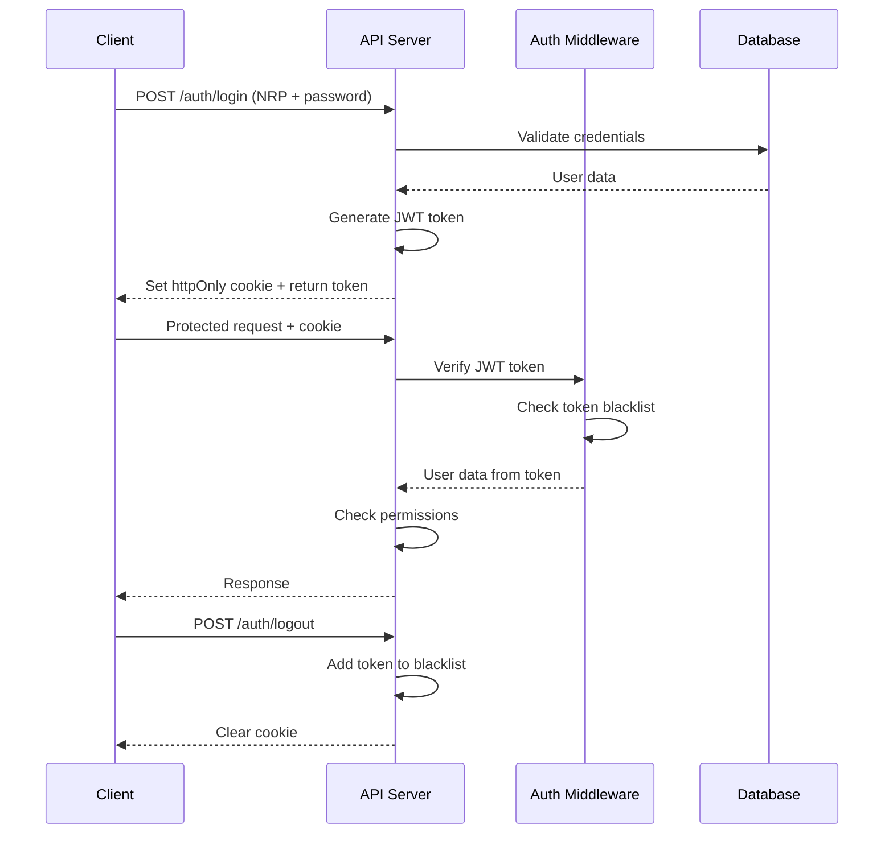

# Authentication Flow

## Overview

The Koperasi Polres API uses **JWT (JSON Web Token)** based authentication with httpOnly cookies. This guide explains the complete authentication flow, token management, and security considerations.

::: info JWT Authentication
The system uses JWT tokens stored in httpOnly cookies for security. Tokens are valid for 24 hours and include user information and role data.
:::

## Authentication Architecture



## Step-by-Step Authentication Flow

### 1. Initial Login

#### Client Request

```http
POST /auth/login
Content-Type: application/json

{
  "nrp": "12345678",
  "password": "user_password"
}
```

#### Server Processing

1. **Validate Input**: Check NRP and password are provided
2. **Find User**: Query database for user with matching NRP
3. **Verify Password**: Compare hashed password using bcrypt
4. **Generate JWT Token**: Create token with user payload
5. **Set Cookie**: Send httpOnly cookie with JWT token
6. **Return Token**: Include token in response body (optional)

#### Success Response

```json
{
  "success": true,
  "message": "Login berhasil",
  "data": {
    "user": {
      "id": "user-id",
      "nrp": "12345678",
      "nama": "John Doe",
      "jabatan": "Brigadir",
      "role": "anggota",
      "status": "aktif"
    }
  }
}
```

#### Session Cookie

```http
Set-Cookie: connect.sid=s%3A...; Path=/; HttpOnly; Secure; SameSite=Lax
```

### 2. Authenticated Requests

#### Client Request

```http
GET /member/profile
Cookie: connect.sid=s%3A...
```

#### Server Processing

1. **Extract Cookie**: Parse session cookie from request
2. **Validate Session**: Check session exists and is valid
3. **Load User Data**: Retrieve user information from session
4. **Check Permissions**: Verify user has required access
5. **Process Request**: Execute the requested operation
6. **Return Response**: Send data or error response

### 3. Session Validation Middleware

#### Authentication Middleware

```javascript
// Simplified middleware logic
const authenticate = (req, res, next) => {
  // Check if session exists
  if (!req.session || !req.session.userId) {
    return res.status(401).json({
      success: false,
      message: "Unauthorized",
    });
  }

  // Add user data to request
  req.authenticatedUser = req.session.userData;
  next();
};
```

#### Admin Authorization Middleware

```javascript
const requireAdminAuth = (req, res, next) => {
  // First check authentication
  if (!req.session || !req.session.userId) {
    return res.status(401).json({
      success: false,
      message: "Unauthorized",
    });
  }

  // Check admin role
  if (req.session.userData.role !== "admin") {
    return res.status(403).json({
      success: false,
      message: "Admin access required",
    });
  }

  req.authenticatedUser = req.session.userData;
  next();
};
```

### 4. Logout Process

#### Client Request

```http
POST /auth/logout
Cookie: connect.sid=s%3A...
```

#### Server Processing

1. **Validate Session**: Ensure user is logged in
2. **Destroy Session**: Remove session from store
3. **Clear Cookie**: Instruct client to remove cookie
4. **Return Success**: Confirm logout completion

#### Success Response

```json
{
  "success": true,
  "message": "Logout berhasil"
}
```

## Role-Based Access Control

### User Roles

| Role      | Description    | Access Level            |
| --------- | -------------- | ----------------------- |
| `anggota` | Regular member | Own data only           |
| `admin`   | Administrator  | All data and operations |

### Permission Matrix

| Endpoint Pattern         | Anggota      | Admin       |
| ------------------------ | ------------ | ----------- |
| `GET /user/*`            | ✅ Public    | ✅ Public   |
| `POST /auth/login`       | ✅ Public    | ✅ Public   |
| `POST /auth/logout`      | ✅ Required  | ✅ Required |
| `GET /member/profile`    | ✅ Own only  | ✅ Own only |
| `GET /member/me/*`       | ✅ Own only  | ✅ Own only |
| `PATCH /member/password` | ✅ Own only  | ✅ Own only |
| `GET /admin/*`           | ❌ Forbidden | ✅ Required |
| `POST /admin/*`          | ❌ Forbidden | ✅ Required |
| `PUT /admin/*`           | ❌ Forbidden | ✅ Required |
| `DELETE /admin/*`        | ❌ Forbidden | ✅ Required |

### Data Access Rules

#### Member Access Rules

- Can view own profile and transaction history
- Can update own password
- Cannot access other members' data
- Cannot perform administrative operations

#### Admin Access Rules

- Can view and modify all member data
- Can perform all financial operations
- Can manage products and categories
- Can access system-wide reports

## Security Features

### Password Security

- **Hashing**: bcrypt with salt rounds
- **Validation**: Minimum length requirements
- **Storage**: Never store plain text passwords

### Session Security

- **HttpOnly Cookies**: Prevent XSS attacks
- **Secure Flag**: HTTPS-only transmission (production)
- **SameSite**: CSRF protection
- **Expiration**: Automatic session timeout

### Input Validation

- **Sanitization**: Clean all user inputs
- **Type Checking**: Validate data types
- **Length Limits**: Prevent overflow attacks
- **SQL Injection**: Protected by Prisma ORM

### CORS Configuration

```javascript
app.use(
  cors({
    origin: [
      "https://koperasi-primkoppolresta.netlify.app",
      "https://koperasi-primkoppolresta.vercel.app/",
    ],
    credentials: true, // Allow cookies
  })
);
```

## Client Implementation Examples

### React Hook for Authentication

```jsx
import { createContext, useContext, useState, useEffect } from "react";

const AuthContext = createContext();

export const AuthProvider = ({ children }) => {
  const [user, setUser] = useState(null);
  const [loading, setLoading] = useState(true);

  useEffect(() => {
    checkAuthStatus();
  }, []);

  const checkAuthStatus = async () => {
    try {
      const response = await fetch("/member/profile", {
        credentials: "include",
      });

      if (response.ok) {
        const data = await response.json();
        setUser(data.data.member);
      }
    } catch (error) {
      console.error("Auth check failed:", error);
    } finally {
      setLoading(false);
    }
  };

  const login = async (nrp, password) => {
    const response = await fetch("/auth/login", {
      method: "POST",
      headers: {
        "Content-Type": "application/json",
      },
      credentials: "include",
      body: JSON.stringify({ nrp, password }),
    });

    const data = await response.json();

    if (data.success) {
      setUser(data.data.user);
      return data;
    } else {
      throw new Error(data.message);
    }
  };

  const logout = async () => {
    await fetch("/auth/logout", {
      method: "POST",
      credentials: "include",
    });
    setUser(null);
  };

  return (
    <AuthContext.Provider
      value={{
        user,
        login,
        logout,
        loading,
        isAuthenticated: !!user,
        isAdmin: user?.role === "admin",
      }}
    >
      {children}
    </AuthContext.Provider>
  );
};

export const useAuth = () => {
  const context = useContext(AuthContext);
  if (!context) {
    throw new Error("useAuth must be used within AuthProvider");
  }
  return context;
};
```

### Vue.js Composition API

```javascript
import { ref, computed } from "vue";

export const useAuth = () => {
  const user = ref(null);
  const loading = ref(false);

  const isAuthenticated = computed(() => !!user.value);
  const isAdmin = computed(() => user.value?.role === "admin");

  const login = async (nrp, password) => {
    loading.value = true;
    try {
      const response = await fetch("/auth/login", {
        method: "POST",
        headers: {
          "Content-Type": "application/json",
        },
        credentials: "include",
        body: JSON.stringify({ nrp, password }),
      });

      const data = await response.json();

      if (data.success) {
        user.value = data.data.user;
        return data;
      } else {
        throw new Error(data.message);
      }
    } finally {
      loading.value = false;
    }
  };

  const logout = async () => {
    await fetch("/auth/logout", {
      method: "POST",
      credentials: "include",
    });
    user.value = null;
  };

  return {
    user,
    loading,
    isAuthenticated,
    isAdmin,
    login,
    logout,
  };
};
```

### Axios Interceptor Setup

```javascript
import axios from "axios";

// Create axios instance
const api = axios.create({
  baseURL: process.env.REACT_APP_API_URL,
  withCredentials: true, // Include cookies
});

// Request interceptor
api.interceptors.request.use(
  (config) => {
    // Add any default headers
    config.headers["Content-Type"] = "application/json";
    return config;
  },
  (error) => {
    return Promise.reject(error);
  }
);

// Response interceptor
api.interceptors.response.use(
  (response) => {
    return response;
  },
  (error) => {
    if (error.response?.status === 401) {
      // Handle unauthorized - redirect to login
      window.location.href = "/login";
    }
    return Promise.reject(error);
  }
);

export default api;
```

## Error Handling

### Authentication Errors

| Error                    | Status | Description                   | Action                |
| ------------------------ | ------ | ----------------------------- | --------------------- |
| Missing credentials      | 400    | NRP or password not provided  | Show validation error |
| Invalid credentials      | 401    | Wrong NRP or password         | Show login error      |
| Account inactive         | 403    | Account suspended/deactivated | Contact admin         |
| Session expired          | 401    | Session timeout               | Redirect to login     |
| Insufficient permissions | 403    | Role-based access denied      | Show access denied    |

### Example Error Handler

```javascript
const handleAuthError = (error) => {
  switch (error.status) {
    case 400:
      return "Please provide both NRP and password";
    case 401:
      return "Invalid NRP or password";
    case 403:
      return "Account is inactive. Please contact administrator";
    default:
      return "Authentication failed. Please try again";
  }
};
```

## Best Practices

### Client-Side

1. **Always include credentials**: Use `credentials: 'include'` for authenticated requests
2. **Handle session expiry**: Redirect to login on 401 responses
3. **Secure storage**: Don't store sensitive data in localStorage
4. **Logout on close**: Consider session cleanup on browser close

### Server-Side

1. **Session timeout**: Implement reasonable session expiration
2. **Rate limiting**: Prevent brute force attacks
3. **HTTPS only**: Use secure cookies in production
4. **Regular cleanup**: Remove expired sessions

### Security Considerations

1. **Never expose session data**: Keep session contents minimal
2. **Validate on every request**: Don't trust client-side role checks
3. **Audit trails**: Log authentication events
4. **Monitor suspicious activity**: Track failed login attempts
